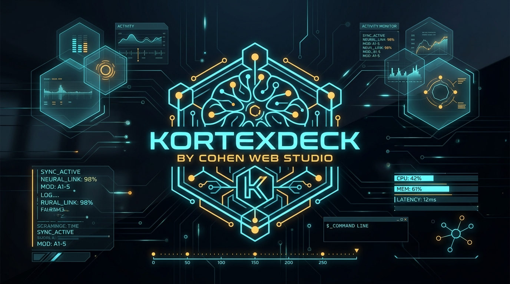

<div align="center">

# ⚡ KORTEXDECK (v2.5 PRO)
### The Neural Command Station for AI Agents & Engineers
**Google Antigravity • Anthropic Claude • Cursor IDE • OpenAI Codex • MCP Ecosystem**

[](https://cohenwebstudio.com/kortexdeck)
[](https://github.com/blackkillers/kortexdeck)
[](https://buymeacoffee.com/studioengine)
[](LICENSE)
[](https://cohenwebstudio.com)

<br/>



</div>

---

## 🌟 About KortexDeck

**KortexDeck** is a unified neural command station indexing **500 curated slash commands (`/`), native agent skills, architectural prompt rules, and Model Context Protocol (MCP) servers**. It is built for next-generation developer workflows across top reasoning LLMs (Google Antigravity 2.0, Claude 3.7 Sonnet, Cursor Composer, and OpenAI Codex).

> 💡 **Zero-API Invariant**: Zero external paid API subscriptions required. Semantic fuzzy search (< 1 ms latency), particle synapse network, dynamic visual thumbnails, and interactive command builders run 100% in client-side memory.

---

## 🚀 Key Features

- 🧠 **500 Curated AI Directives & Tools**:
  - **Google Antigravity**: Autonomous slash commands (`/goal`, `/schedule`, `/browser`, `/grill-me`, `/teamwork-preview`, `/learn`, `/boost`), BigQuery, Firebase, Flutter/Dart, and Bioinformatics suites (AlphaFold, PubMed, ChEMBL).
  - **Anthropic Claude**: Claude Code CLI commands (`/bug`, `/compact`, `/cost`, `/doctor`, `/init`, `/review`, `/test`...), structural XML prompting, and context caching strategies.
  - **Cursor IDE & Codex**: `@codebase`, `@web`, `@docs` symbols, strict `.cursorrules` (TypeScript Strict, RSC, TDD, OWASP).
  - **Model Context Protocol (MCP)**: Official and community servers (`filesystem`, `postgres`, `git`, `github`, `puppeteer`, `brave-search`, `docker`, `kubernetes`, `sentry`, `linear`, `notion`...).
- ✨ **Dynamic React Particle & Motion Effects**:
  - Interactive neural synapse canvas network reacting to mouse movements.
  - Ambient glowing orb animations and micro-interactions on cards and badges.
- ⚡ **1-Click Local Configuration Sync**:
  - Direct, safe injection into `~/.cursorrules` and `~/.claude/CLAUDE.md`.
  - Automatic safety backups (`.bak`) generated prior to every write operation.
- 🎨 **Graphic Thumbnails & Card Badges**:
  - Color-coded engineering themes, platform badges, and difficulty indicators (Beginner, Intermediate, Advanced).
- 🛠️ **Interactive Command Builder**:
  - Customize argument values live with immediate command-line preview and 1-click clipboard copy.
- 📦 **Multi-Format Export**:
  - 1-click export to Markdown (`.md`), JSON, `.cursorrules`, or `CLAUDE.md`.

---

## 💻 Terminal Automation (CLI Sync Script)

Apply your customized stack directly from your terminal:

```bash
chmod +x ./scripts/sync-stack.sh
./scripts/sync-stack.sh
```

The script automatically synchronizes:
1. `~/.cursorrules` (for Cursor IDE)
2. `~/.claude/CLAUDE.md` (for Claude Code & Claude Desktop)

---

## 🏗️ Architecture & Component Hierarchy

```
kortexdeck/
├── public/
│   └── images/
│       └── kortexdeck_hero.jpg      # Official visual artwork
├── src/
│   ├── components/
│   │   ├── Logo.jsx                 # Animated vector neural mark
│   │   ├── Navbar.jsx               # Header with global search & quick links
│   │   ├── HeroStats.jsx            # Neural hero showcase & AI bridges
│   │   ├── FilterBar.jsx            # Multi-facet filters & categories
│   │   ├── CommandCard.jsx          # Interactive card with copy & save
│   │   ├── DetailModal.jsx          # Deep documentation modal & builder
│   │   ├── CommandBuilder.jsx       # Dynamic argument generator
│   │   ├── FavoritesDrawer.jsx      # Custom stack drawer & export engine
│   │   ├── SyncModal.jsx            # 1-click local sync automation
│   │   ├── AIBridgeModal.jsx        # Direct prompt bridge for 4 AI engines
│   │   ├── BackgroundEffects.jsx    # Real-time synapse canvas & ambient lights
│   │   └── ThumbnailGenerator.jsx   # Vector thumbnail renderer
│   ├── data/
│   │   ├── commandsData.json        # Database of 500 AI tools & skills
│   │   └── categories.js            # Filter definitions & taxonomy
│   ├── utils/
│   │   └── searchEngine.js          # Client-side MiniSearch indexing
│   ├── App.jsx                      # Main application orchestrator
│   └── main.jsx
├── scripts/
│   └── sync-stack.sh                # Shell sync script
├── vite.config.js                   # Vite bundler configuration
└── tailwind.config.js
```

---

## ☕ Support the Project

If **KortexDeck** enhances your development workflow, feel free to support our work:

👉 **[Buy Me a Coffee](https://buymeacoffee.com/studioengine)**

---

## 👨‍💻 Author & Credits

- **Designed & Developed by**: **Cohen Web Studio**
- **Official Website**: [https://cohenwebstudio.com](https://cohenwebstudio.com)
- **Live Deployment**: [https://cohenwebstudio.com/kortexdeck](https://cohenwebstudio.com/kortexdeck)
- **GitHub Repository**: [https://github.com/blackkillers/kortexdeck](https://github.com/blackkillers/kortexdeck)
- **License**: [MIT](LICENSE)
